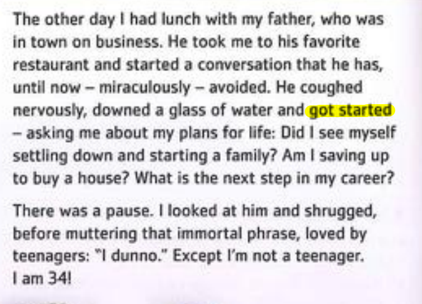
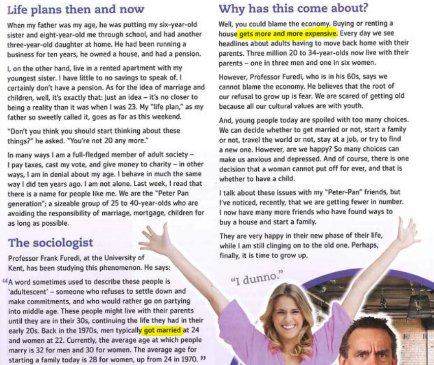
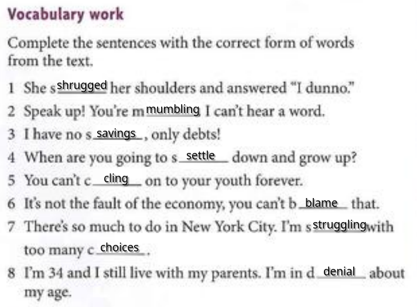

---

# 1. Modal and related verbs
## Probability
- I **may** go to the party

## Advice
- You **should** keep your mouth shut

## Obligation
- You **must** listen to me

## Un/willingness
- I **will** quit my job

# 1/21/2025

- She shrugged her shoulders and answered, "I dunno."
- Speak up! You’re mumbling. I can’t hear a word.
- I have no savings, only debts!
- When are you going to settle down and grow up?
- You can’t cling on to your youth forever.
- It’s not the fault of the economy, you can’t blame that.
- There’s so much to do in New York City. I’m struggling with too many choices.
- I’m 34 and I still live with my parents. I’m in denial about my age