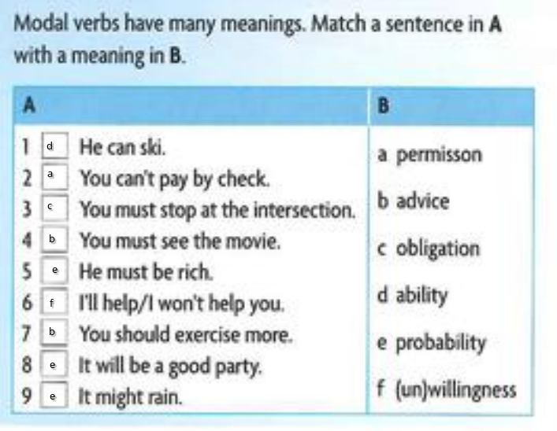
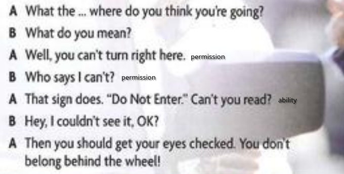
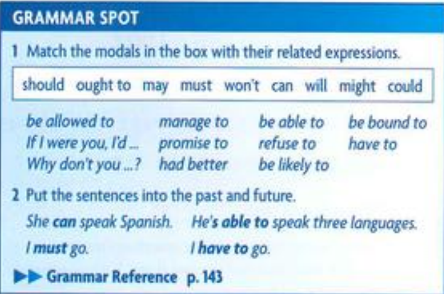
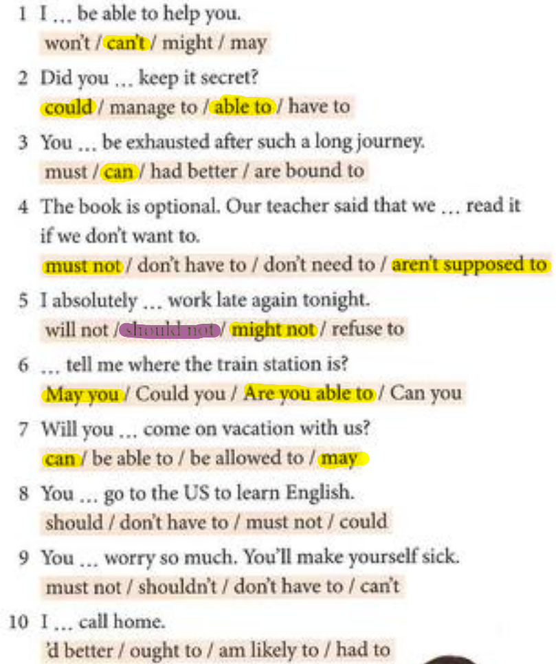
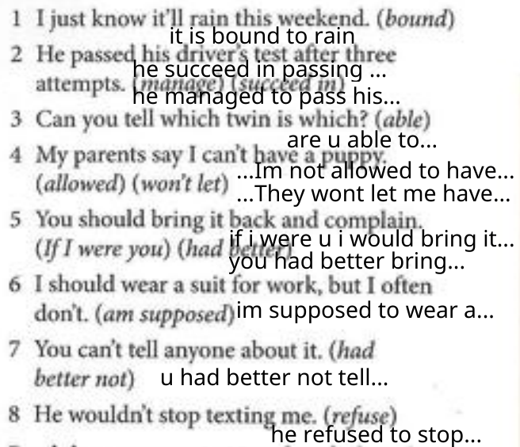
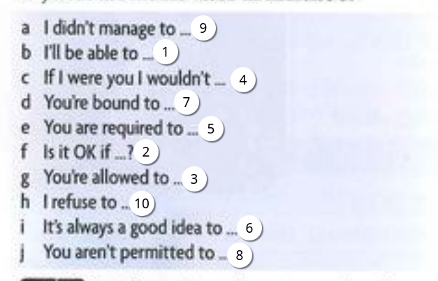

## Work 1
Example of the modal or related verb i find more difficult

**Allow to**:
- You **are allowed to** run at the park but not at home

## Work 2

## Grammar Spot

### 1.
Should:
- Why dont you...?
- had better
- If i were yo. I'd

Ought to:
- Why dont you...?
- had better
- If i were yo. I'd

May:
- be allawed to

Must:
- have to
- be likely to

Wont:
- refuse to

Can:
- be able to
- manage to

Will:
- promise to
- be bound to
- be likely to

Might:
- be likely to

Could:
- be able to
- manage to
---
> little activity

- I should sleep early tonight
- I had better sleep early tonight
---
### 2. put the sentences into the past and future
- she can speak spanish
- She could speak spanish
- she will be able to speak spanish
---
- he's able to speak three lengauges
- he was able to speak three lengauges
- he will be able to speak three lengauges
---
- i must go
- i had to fo
- i will have to go
---
- i have to go
- i had to go
- i will have to go
---

### 3.

1. I <ins>can</ins> take you to the airport, after all.
2. <ins>May</ins> I make a suggestion?
3. You <ins>can</ins> use your cell phone during breaks.
4. You <ins>shouldn’t</ins> wear red, it doesn’t suit you.
5. You <ins>must</ins> obtain a visa to work in Australia.
6. You <ins>should</ins> always make an appointment.
7. You <ins>will</ins> pass. Don’t worry.
8. You <ins>must not</ins> walk on the grass.
9. I <ins>couldn’t</ins> get through, the line was busy.
10. I <ins>won’t</ins> discuss the matter any further.

