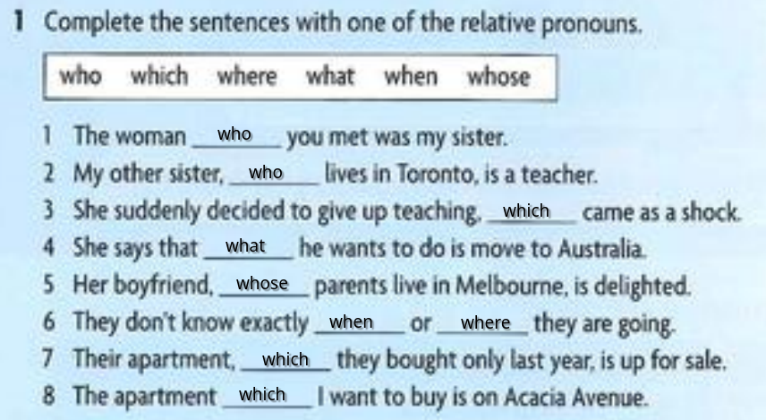
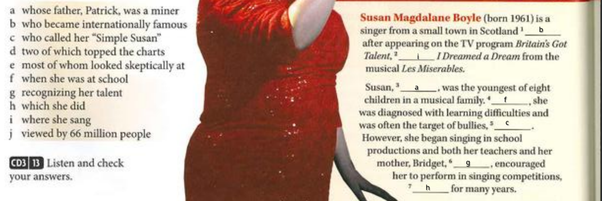
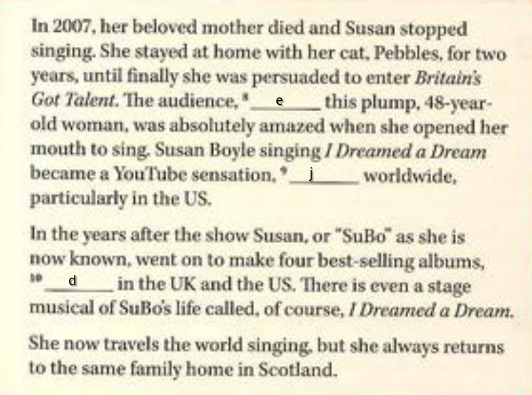
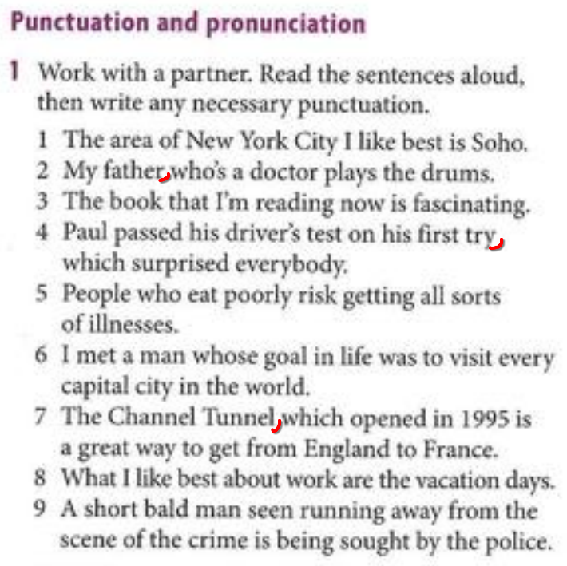
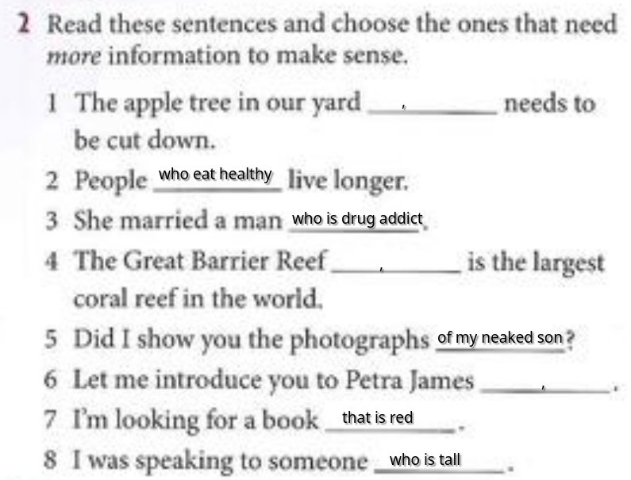
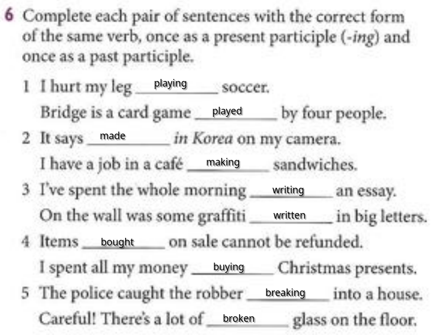
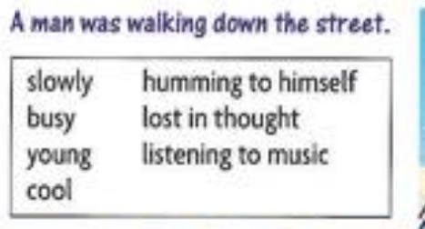

# work 1/24/2025
- The psychopath who i was talking about is in the jail
- My earphones, which i bought last week are broken

# work 1/27/2025
- The cat that is orange is mine
- The kid that is eating an icie is my friend
- The dancer who has a red dress is the best

# work 1/28/2025

# work 1/29/2025

# work 1/30/2025

A young and cool man was walking slowly down the busy street, humming to himself, lost in thought, and listening to music.

# work 1/31/2025
Topic | Type | Example
--- | --- | ---
Relative Clauses | Defining | "Mom! Shauna Glassman had five caterers at her Bat Mitzvah, and everyone talked about how great that was, so we need six caterers." 
Present Participle | Adjective | Tina, I am up to my pits in Bat Mitzvah planning
Past Participle | Adjective | Tina, that's the third time you sighed on my sandwich