# 2/10/2025 
1. Tania **got used to** drinking coffee bc her boyfriend likes it very much.
2. During the pandemic I **would to play** Roblox everyday
3. My mom **used to** cook for us when we were children
4. I don't need an alarm, I **am used to** waking up early

# 2/11/2025
## Expressing present habit (1 phrase of every type)
1. In walmart they **have** chicken nuggets
2. I **am always** late to work
3. He **will** listening music while he works

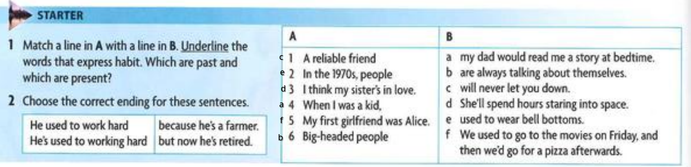

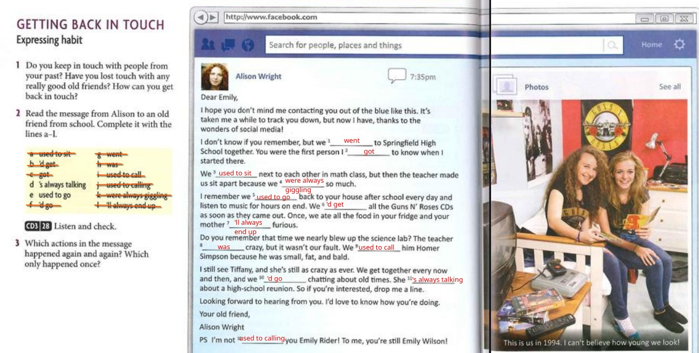
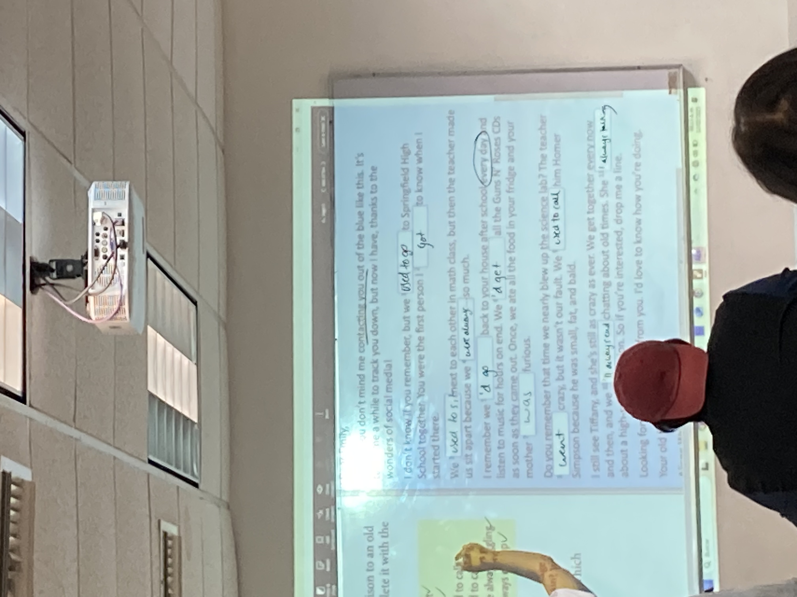

## 2/12/2025
### first part
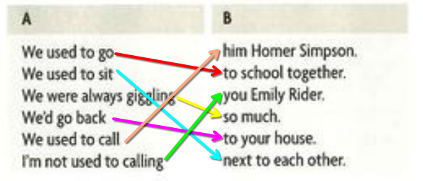

### second part
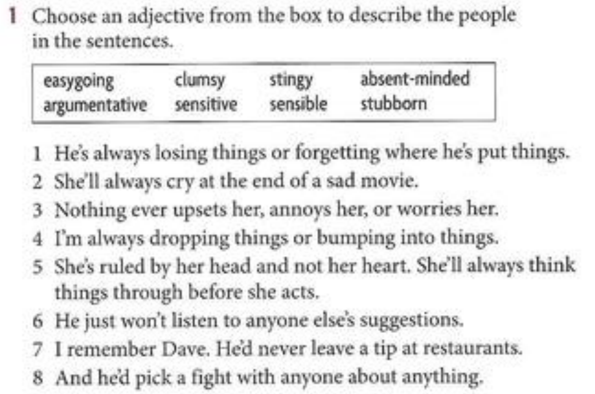

1. Absent-minded 
2. Sensitive 
3. Easygoing 
4. Clumsy 
5. Sensible 
6. Stubborn 
7. Stingy 
8. Argumentative 

# 2/17/2025
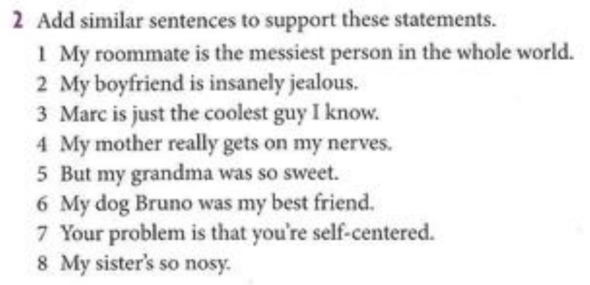
1. He's always leaving his stuff on the floor
2. -
3. He's smart and easy going

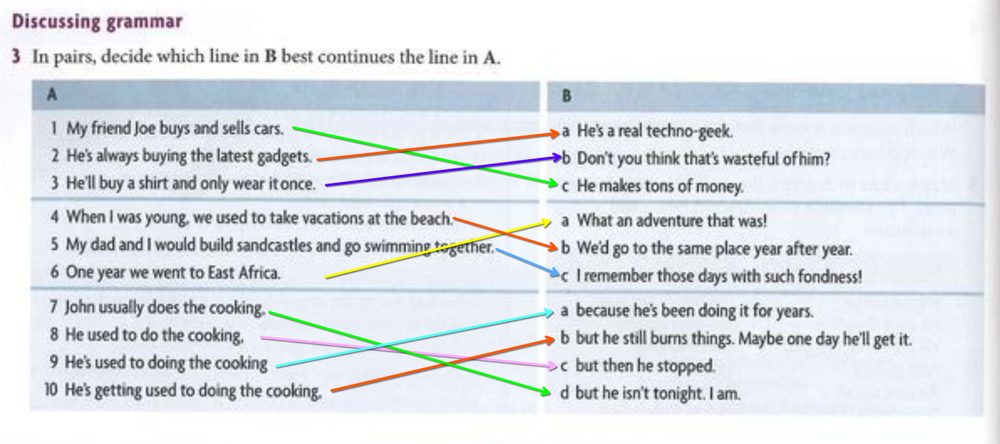

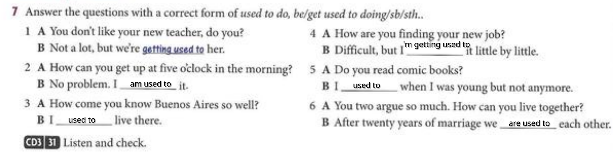

# 2/19/2025
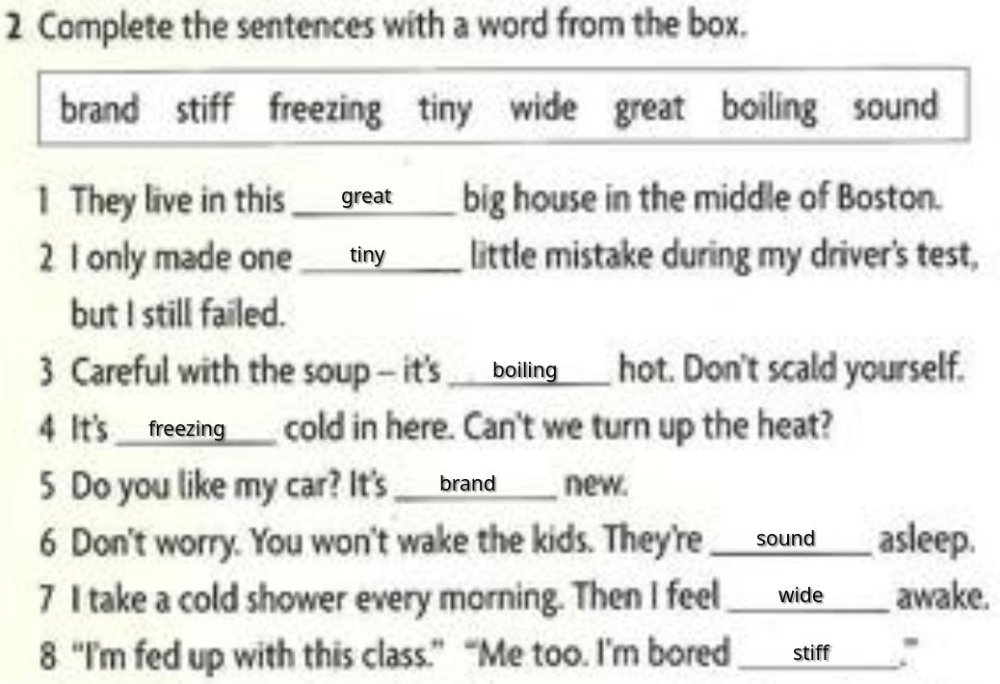
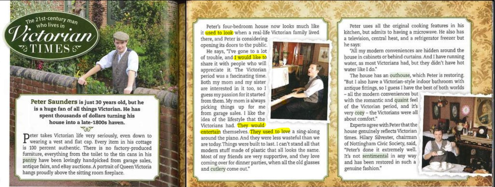

# 2/21/2025
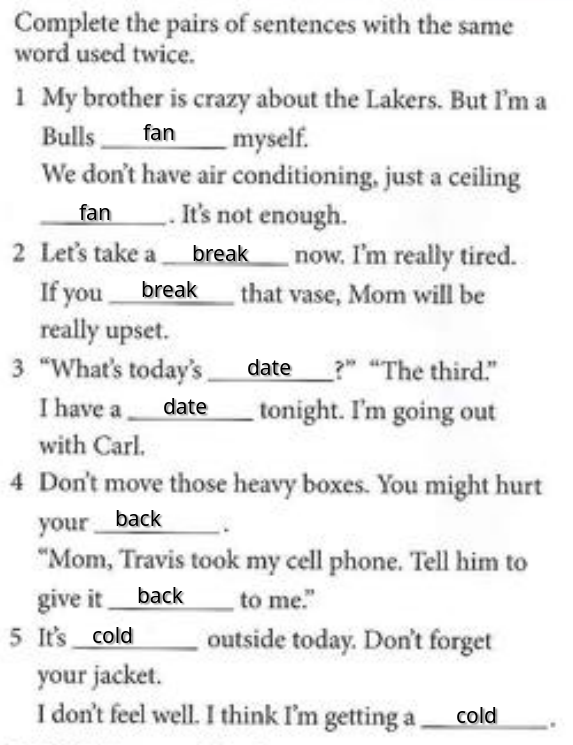
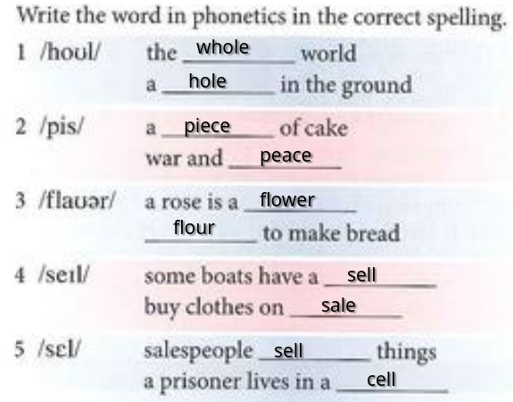