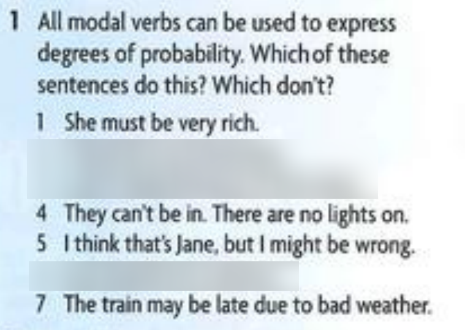
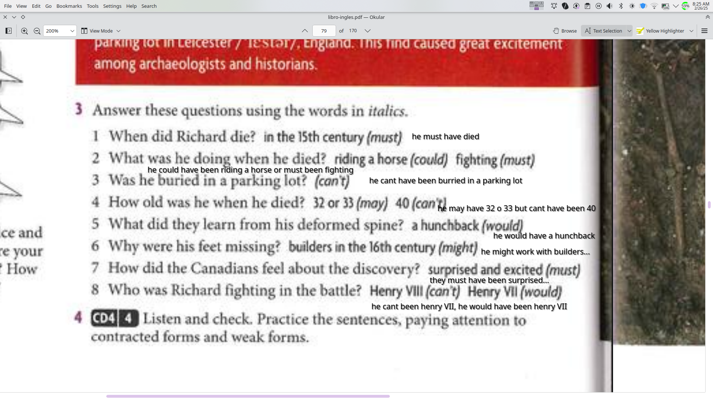

# 2/24/2025
- The guy might have gotten shot in the foot.
- The girl must have been thirsty.
- Those who killed the cleaning lady shouldn't have broken the jar

# 2/25/2025
## What should they have done?
- I cheated on my boyfriend with a clase friend. I did it because I am not in love with him anymore
  - You should have told him the truth and break up with him

# 2/26/2025

1. he must have died
2. he could have been riding horse or must been fighting
3. he cant been burried in a parking lot
4. He may have been 32 or 33 but cant have been 40
5. he would have been a hunchback
6. they might have been cut by builders...
7. they must have been surprised
8. he cant been henry VIII, he would have been henry VII