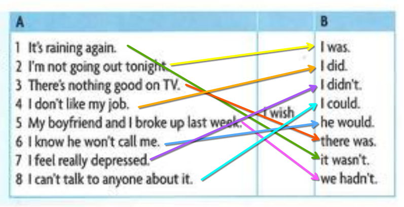
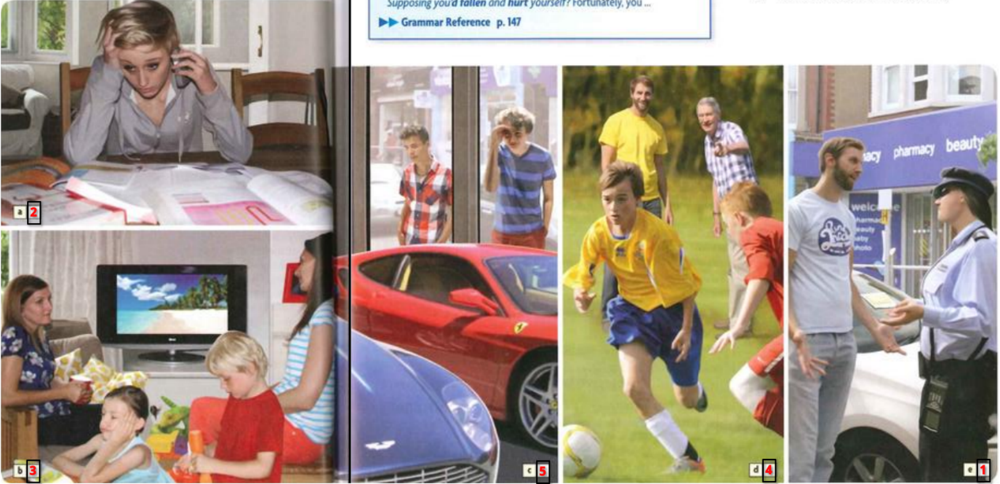
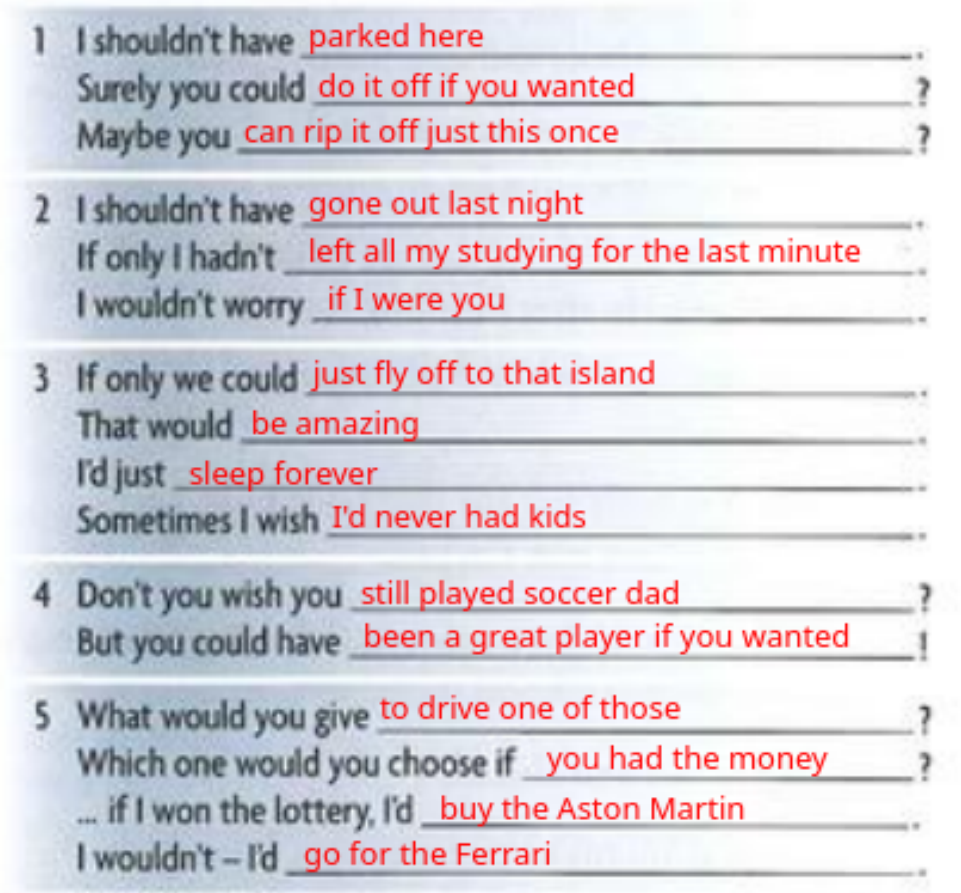
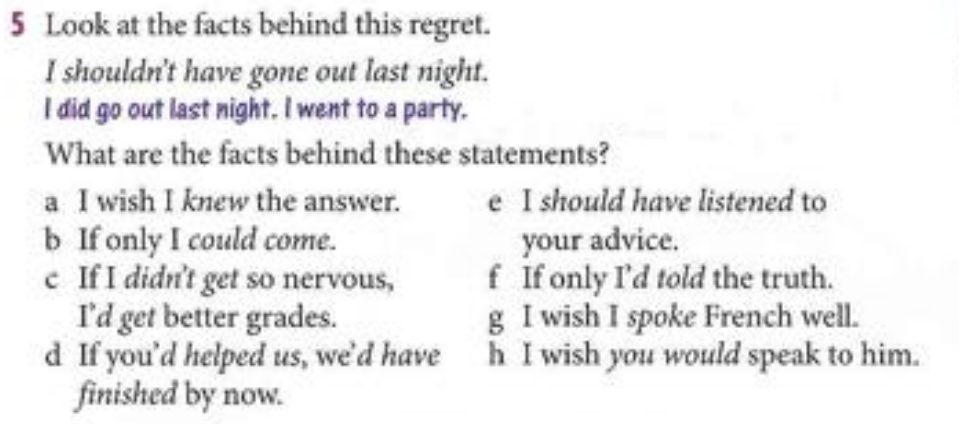
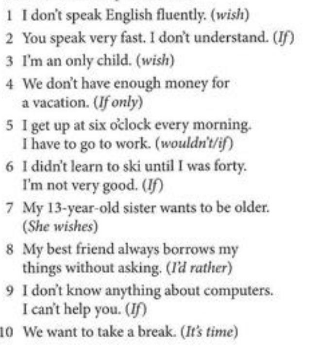
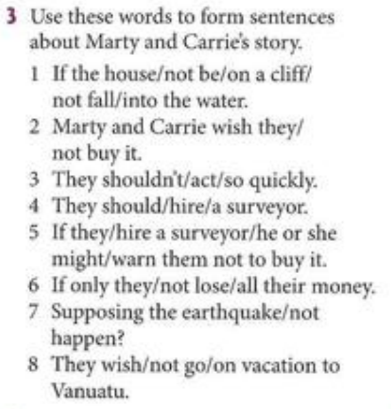
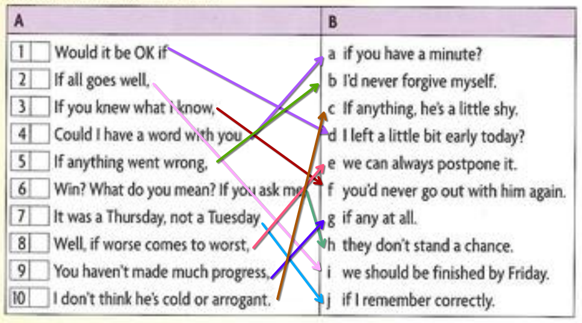
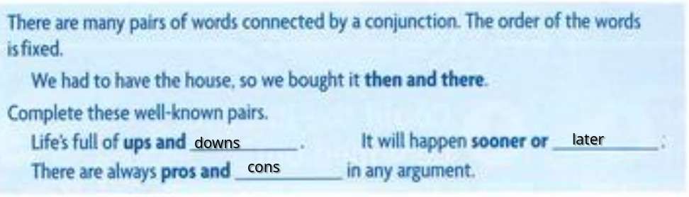
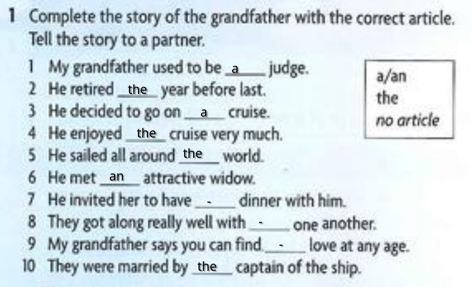

# something i wish now and something i wished in the past
- I wish I had a job
- i wish my childhood had lasted longer

# 3/19/2025

# 3/20/2025

# 3/21/2025

c. i get nervous so I get bad grades
d. You didnt help us so we havent finished
e. I didnt listen to your advice
f. I dindt tell the truth
g. I dont speal french well
h. you dont speak to him

I wish I had better news for you, Hal

The prosecution has 30 eyewitnesses that can all avoid going to prison themselves by fingering you

# 3/24/2025

- I wish i spoke english fluently
- If you spoke slowoly I would understand
- I wish i weren't an only child / I wish i had siblings
- If we only had money for a vacation
- I wouldthe get up at six o'clock every morning I i didnt have to go to work
- If i had learn to ski before 40, I would be better at it
- She wishes she were older
- I rather my best frienf asked me before borrowing my stuff
- I only I knew somthing about computers. I could help you
- Its time we take a break

# 3/25/2025

1. If the house hadnt been on a cliff, It wouldnt have fallen into water
2. Marty and carrie wish they hadnt bought it
3. They shouldn't have acted so quickly
4. they should have hired a surveyor
5. If they had hired a suveyor, he or she might have warned them not to buy it
6. If only they hadn't lost all their money
7. supposing the earthquake hadnt happened
8. they wish they hadnt gone on vacation to Vanuatu

# 3/26/2025

But you'll find out just wait and see
Im the greatest trainer of the world, take it or leave it

## homework
1. In any relationship you have to be prepared to give and take. You can’t have your own way all the time.
2. I didn’t buy much at the mall. Just a few odds and ends for the kids. Socks for Ben and hairbands for Jane.
3. I don’t want to hear any ifs or buts. Just finish the job today.
4. It’s hard to explain the ins and outs of the rules of cricket. It’s complicated.
5. “What did you get me for my birthday?” “You’ll have to wait and see.”
6. “Oh, no! The Burtons are coming for lunch! I hate their kids!” “I’m sorry, but you’ll just have to grin and bear it. It’s only for an hour or so.”
7. OK, you can have it for $90. That’s my final offer, take it or leave it.
8. Los Angeles has lots of problems, but by and large, it’s a nice place to live.

# 3/31/2025

