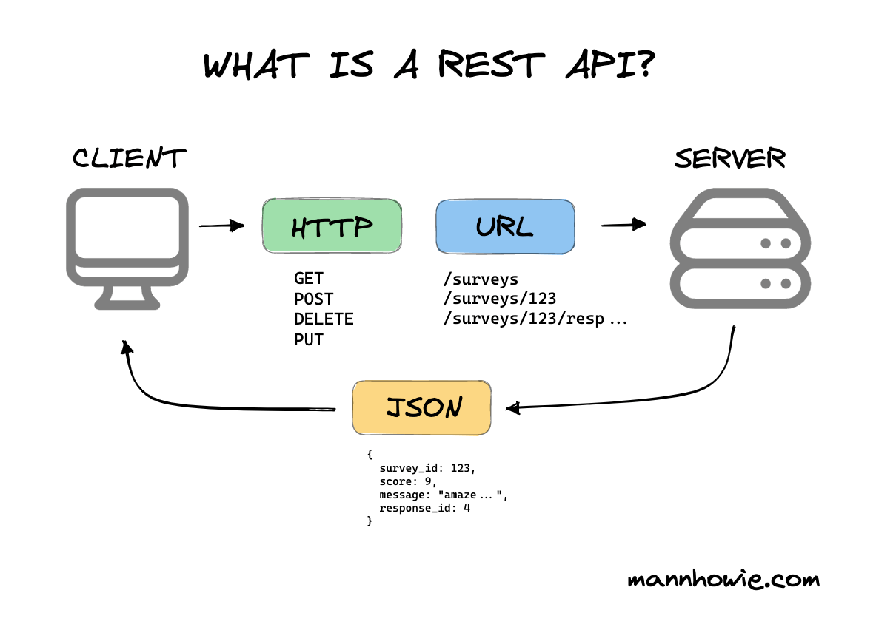
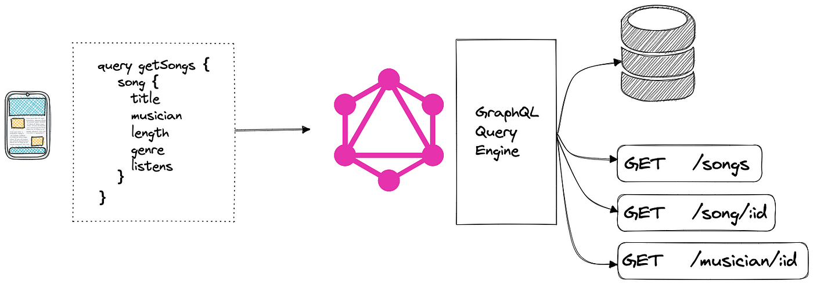

# Arquitectura de Aplicaciones Web
---
## Tecnologías de la Internet
### Intranet
Red informática que hace uso de la tecnología del protocolo de internet para compartir información, sistemas operativos o servicios computacionales dentro de una organización.

### Dominio de Internet
Red de identificación asociada a un grupo de dispositivos o equipos conectados a la red internet.

El propósito principal de los nombres de dominio en internet y del sistema de nombres de dominio (DNS), es traducir las direcciones IP de cada nodo activo en la red, a términos memorizables y fáciles de encontrar.

### World Wide Web
Sistema de distribución de documentos de hipertexto o hipermedios interconectados y accesibles via internet.

Desarrollado entre marzo de 1989 y 1990 por Tim Barnes Lee, en el CERN en Ginebra, Suiza.

### Estándares Web
-  **Identificador de Recurso Uniforme** (URI), que es u sistema universal para referenciar recursos en la web, como paginas web.
-  **Protocolo de Transferencia de Hipertexto** (HTTP), que especifica como se comunican el navegador y el servidor de ellos
-  **Lenguaje de Marcado de Hipertexto** (HTML), usado para definir la estrcutura y contenido de documentos de hipertexto
-  **Lenguaje de Marcado Extensible** (XML), usado para describir la estructura de los documentos de texto.

### Funcionalidades de la Web
El primer paso consiste en traducir la parte nombre del servidor de la URL en una dirección IP usando la base de datos distribuida de Internet conocida como DNS. Esta dirección IP es necesaria para contactar con el servidor web y poder enviarle paquetes de datos.

El siguiente paso es enviar una petición HTTP al servidor web solicitando  el recurso. En el caso de una pagina web típica, primero se solicita el texto HTML y luego es inmediatamente analizado por el navegador, el cual, después hace peticiones adicionales para los gráficos y otros ficheros que formen parte de la pagina.

Al recibir los ficheros solicitados desde el servidor web, el navegador representa (renderiza) la pagina tal y como se describe en el código HTML, el CSS y otros lenguajes web.

### Servidor Web
Programa informático que procesa una aplicación del lado del servidor, realizando conexiones bidireccionales y/o unidireccionales y síncronas o asíncronas con el cliente y generando o cediendo una respuesta en cualquier lenguaje o aplicación del lado del cliente.

#### Ejemplos
- Apache
- Cherokee
- nginx
- IIS
- Lighttpd
- Kestrel

### Pagina Web
- Es una una fuente de información adaptada para la WWW y accesible mediante un navegador de internet
- Se presenta generalmente en formato HTML y puede contener hiperenlaces a otras paginas web, constituyendo la red enlazada de la WWW

### Sitio Web
- Conjunto de paginas web, típicamente comunes a un dominio de Internet o subdominio en la WWW en Internet
- Su principal objetivo es entregar información
- Consumir el contenido es la tarea mas importante
- Tienen varias paginas interconectadas y comúnmente tienen un gestor de contenidos

### Portal Web
- Es un sitio web cuya caractteristica fundamental es la de servir de Puerta de entrada (unica) para ofrecer al usuario, de forma facil e integrada, el acceso a una serie de recursos y de servicios relacionados a un mismo tema.

### Aplicación Web
- TIene como objetivo que el usuario realice una tarea o un proceso
- También puede referirse como un programa que  se utiliza desde el navegador web
- Ejemplos: Servicios de banca en linea. Google Docs, sitios de venta de retail.

### Diferencia entre Sitios Web y Aplicaciones Web

- Los sitios web son fuentes de información, mientras que las aplicaciones se centrar en la realización de acciones
- Un aplicación web puede ser parte de un sitio en un proyecto pero no al revés
- Las funciones y tareas de una aplicación son muchas mas y tienen un nivel de complejidad mas elevado

## Interface de Programación de aplicaciones (API)
- Conjunto de subrutinas, funciones y procedimientos que ofrecen cierta biblioteca para poder ser utilizados por otro software como una capa de abstracción
- Ejemplos:
  - Microsoft Win32 API
  - Microsoft WMI
  - DirectX
  - OpenGL

### Web API
- Es una API para un servidor web o un navegador web
- Es un concepto de desarrollo web que hace referencia a una aplicación web.
- Una Web API del lado del servidor es una API que contiene uno a mas endpoint expuestos públicamente en un definido sistema de mensajes de tipo petición-respuesta (comúnmente HTTP).
- Para la transferencia de datos pueden usar JSON o XML.

### Web service
- Según la W3C:
- Web service es un sistema de software diseñado para soportar la interoperatividad entre la interacción maquina a maquina en una red. Tienen una interface descrita en un formato (específicamente WSDL). Otros sistemas interactúan usando mensajes SOAP y típicamente usando HTTP y una serializacion XML.
- Ejemplo: https://tribunalelectronico.gob.mx/WebApi/Services/Externos/WS.svc?singleWsdl

### REST (Representational State Transfer)
- Estilo de arquitectura de software que es un subtipo de HTTP
- No tiene un estándar oficial
- Representa recursos (definición algo abstracta, pues puede representar cualquier cosa: entidad, archivo, acción...)
- Los datos pueden representarse en JSON, XML, HTML o cualquier otro formato.
- Hace uso de los métodos HTTP GER, POST, PUT DELETE, PATCH para representar las acciones a realizar con los recursos.

### What is a REST API

### GraphQL
- Lenguaje de consulta y un tiempo de ejecución del servidor para interfaces de programación de aplicaciones (API).
- Su función es brindar a los clientes exactamente a los datos que solicitan y nada mas
- Permite a los desarrolladores crear consultar para extraer datos de varias fuentes en una sola llamada a la Api 
- Desarrollador por Facebook en 2021 y liberado públicamente.

### gRPC
- Marco de llamada a procedimientos remoto
- (RPC) de alto rendimiento e independiente del lenguaje 
- Diseñado por Google
- Usa HTTP/2 para envió de datos en la capa de transporte
- Usa Protocol Buffers para la gestión de la estructura y distribución de datos
- Permite streaming de datos
- Señalización Binaria

### Modelo Vista Controlador 
- Patrón de arquitectura de software que separa los datos, la forma de representar los datos y la lógica de negocio
- Se construye en tres componentes:
  - **Modelo**: Representación de la información
  - **Controlador**: Encargado de responder a eventos, puede enviar comandos a la vista
  - **Vista**: Encargado de presentar el modelo al usuario
- 