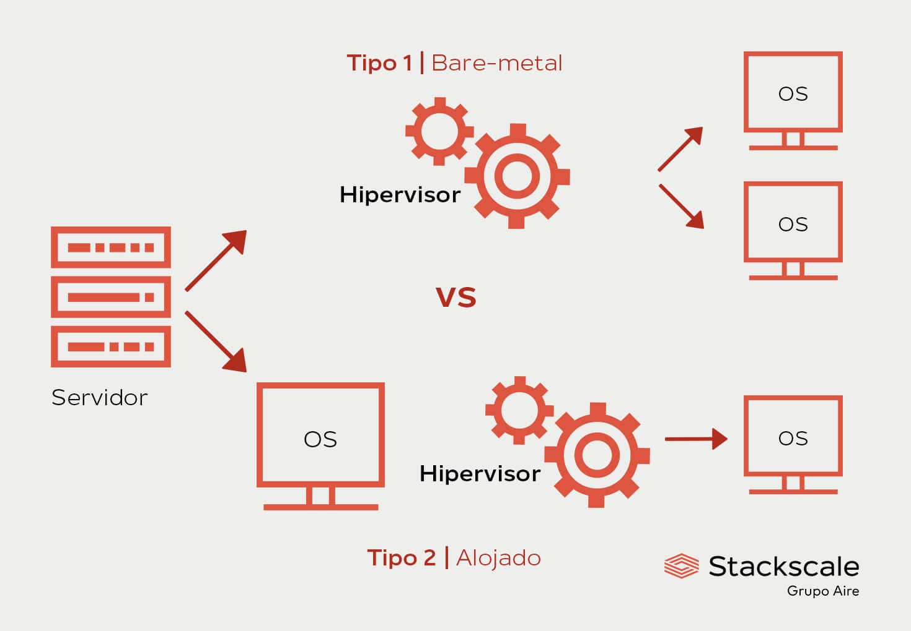
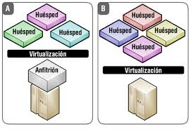

## Que es la virtualizacion
- La virtualizacion es una tecnología que permite crear una versión virtual de un dispositivo o recurso, como un servidor, un sistema de almacenamiento, una red o incluso un sistema operativo

## Que es el hypervisor
- El hypervisor es el componente principal de una plataforma de virtualizacion de servidores
- Un hypervisor es un software o firmware que permite crear y gestionar maquinar virtuales (VM) en un sistema físico
- El hypervisor es el encargado de la asignación de los recursos como la RAM, Disco Duro, entre otras características

## Tipos de Hypervisor
### Tipo 1
- Se instalan directamente en el hardware del host
- No requiere un sistema operativo anfitrión
- Ejemplo:
  - VMware, Microsoft Hyper-V, XenServer

### Tipo 2
- Se ejecuta sobre un sistema operativo anfitrión como Windows, Linux o macOS.
- Ejemplo:
  - Oracle VirtualBox, VMware Workstation, Parallels Desktop

## Características de la virtualizacion
- Seguridad mejorada
- Reducción de costos: Los costos de equipo de computo, seguridad y mantenimiento se reducen considerablemente
- Recuperación y respaldo: las maquinas virtuales al ser, de una manera simple, un archivo estas pueden ser recuperadas y respaldadas con facilidad
- Escalabilidad y portabilidad: Si es necesario el cambio de equipo, por obsolencia o aumento/disminución de la carga de trabajo, esta puede ser realizada de manera sencilla
- Ahorro energético: De 8 maquinas virtualizadas solo consume 1.

## Conceptos Basicos
### Huesped
- El  termino huesped se refiere al sistema operativo que se ejecuta dentro de una maquina virtual
- El inviado virtual (generalmente conocido como VM) consiste en un conjunto de archivos que representan al servidor o sistema virtual en si.

Ejemplo:
- Si se instala ubuntu en una maquina virtual dentro de VirtualBoz, Ubuntu es el sistema operativo huesped.

### Anfrition (Host)
-  Un host es una plataforma de virtualizaicon que ejecuta el software de hipervisor, sienod entre estos servidores o computadoras con un sistema operativo tradicional

#### Ejemplo hipervisor tipo 1
- Si se tiene un servidor fisico con VMware ESXi instalado, el hipervisor ESXi actua como anfitrion y directamente administra las maquina virtuales.

#### Ejemplo hipervisor tipo 2
- Si se instala VirtualBox en una PC con widnows 10, el sistema operativo Windows 10 es el anfitrion y virtualboz es el hipervisor que crea y gestiona las maquinas virtuales

### Emulacion vs Simulacion
Definicion de la RAE: 
- Emular: Imitar las acciones de otro procurando igualarlas e incluso excederlas
- Simular: Representar algo, fingiendo o imitando lo que es o no es

### Emulacion
- La emulacion se refiere al proceso de crear un ambiente en el cual un sistema puede emular las condiciones y recursos de otro sistema completamente distinito.
- Los emuladores a su vez, con ayuda de un interprete, "traducen" las acciones del sistema huesped al sistema anfitrionn
- Este tipo de programas son bastante populares para la emulación de programas que han quedado obsoletos o videojuegos antiguos

### Simulacion
En informatica, una simulacion es el proceso en el cual un sistema anfitrion imita el comportamiento, variables y la configuracion de un sistema huesped.

### Diferencia en pocas palabras:
- **Emulación:** Replica fielmente el comportamiento de un sistema para ejecutar software o hardware diseñado para él.  
- **Simulación:** Crea un modelo aproximado de un sistema para analizar o predecir su comportamiento.

## Tecnicas de Virtualizacion
1. Virtualizacion de Servidores
2. Virtualizacion de Escritorios
3. Virtualizacion de Aplicaciones
4. Virtualizacion de Redes
5. Virtualizacion de Almacenamiento
6. Virtualizacion de Datos

### Virtualizacion de Servidores
- La virtualizacion de servidores es un proceso que tarticiona un servidor fisico en multiples servidores virtuales. Cada uno de los cuales puede ejecutar su propio sistema operativo y aplicaciones.

### Virtualizacion de Escritorios
- La virtualizacion de escritorios te permite ejecutar multiples sistemas operativos de escritorio, cada uno en su propia maquina virtual (VM) en la misma computadora.

### Virtualizacion de Aplicaciones
- **Virtualizacion local de aplicaciones**: La aplicación se ejecuta en el dispositivo del usuario, pero  esta virtualizada, lo que significa que funciona en un entorno aislado, independiente del sistema operativo local.
- **Transmisión de aplicaciones**: La aplicación reside en un servidor que envía pequeños componentes del software al dispositivo del usuario final según se necesiten para su ejecución.
- **Virtualizacion de aplicaciones basada en servidor**: La aplicación se ejecuta completamente en un servidor, que envía unicamente su interfaz de usuario al dispositivo cliente.

