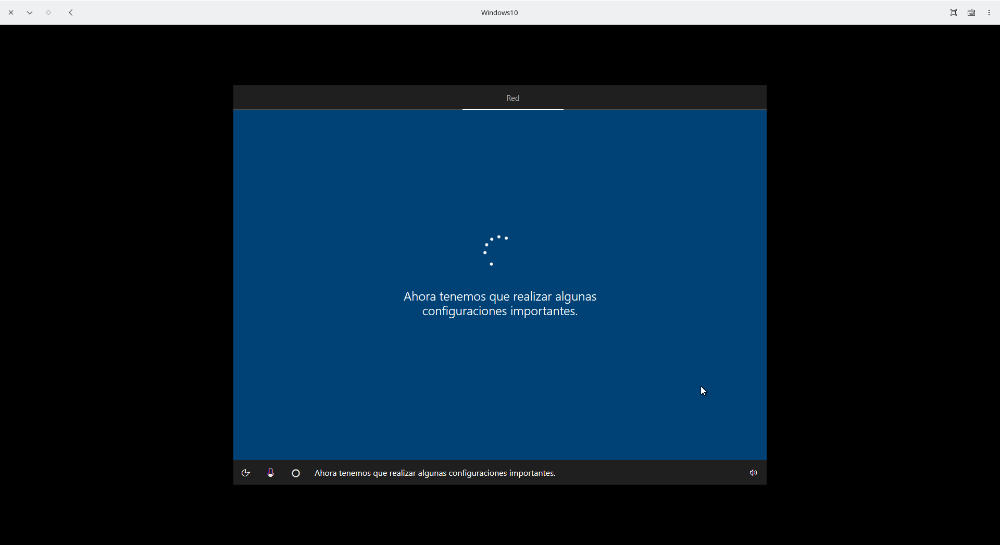

# Manual De Virtualización (Gnome-Boxes)
_Ricardo Emmanuel Uriegas Ibarra - 2230122_

## Pasos para Crear y Configurar la Máquina Virtual en Gnome Boxes

### 1. Creación de la Máquina Virtual
1. Abrir Gnome Boxes y hacer clic en "Nueva" lo cual te mandara a elegir el archivo ISO correspondiente al sistema operativo a instalar.

2. Asigna un nombre a la máquina virtual y selecciona el tipo y la versión del sistema operativo.

    
### 2. Instalación del Sistema Operativo
1. Automáticamente se monta la imagen ISO de Windows 10 en la unidad virtual.

2. Sigue los pasos de instalación de Windows como si fueras a instalar en una computadora normal.

    
### 3. Configuración y Ajuste de Recursos
1. Ajusta la memoria RAM y núcleos de CPU desde la sección de configuración. También en esta sección se puede administrar el almacenamiento mas no la red (ya que esta por defecto se toma del anfitrión).

2. Si desea ajustar mas a fondo (como por ejemplo controladores de red) debes tener conocimientos mas profundos y modificar el archivo XML de la máquina virtual.

3. También se puede configurar snapshots (copias de seguridad que toman una foto al sistema para poder regresar a ese punto en caso de fallo). 
